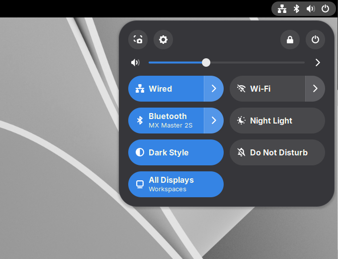

# Monitor-Workspaces-Toggle (Gnome Shell extension)

This Gnome Shell extension adds a quick settings toggle to switch the multitasking settings between "workspaces on primary display only" and "workspaces on all displays". That's it.

## Installation on Arch Linux
`makepkg -si`